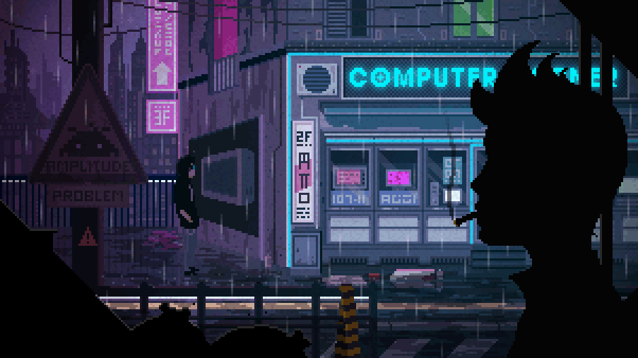

## Faaaala dev, Weslley Francis Aqui!

  
  
  

 

 
  
 
    
    <h1 align="center">Melhores Tecnologias <3</h1>
    
    
    
    
    
    
    
   

  
  <h1 align="center">Redes Sociais</h1>
    
    
    
    

